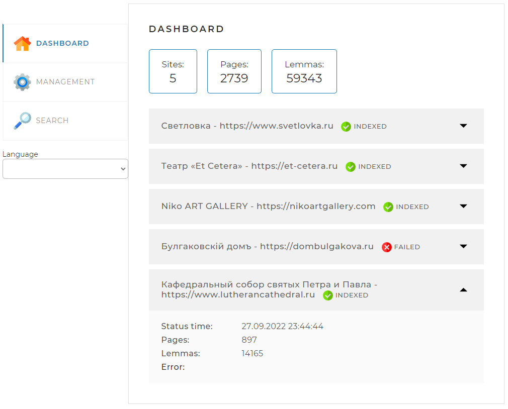
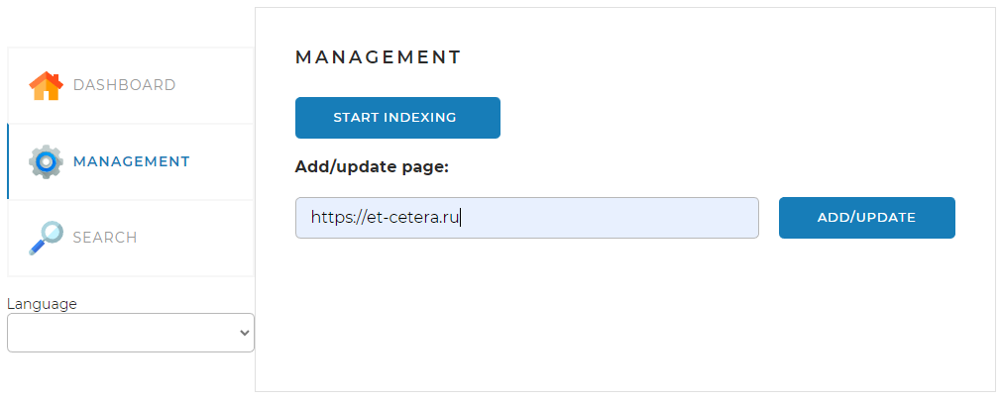
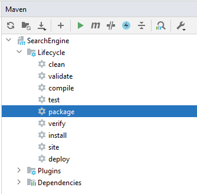

# SearchEngine
Данный проект реализует поисковый движок, предоставляющий пользователю специальный
API со следующими основными функциями: 
<li>предварительное индексирование сайтов;</li>
<li>выдача основных сведений по сайтам;</li>
<li>поиск ключевых слов в проиндексированных сайтах и предоставление их пользователю.</li>

## Веб-страница

В проект также входит веб-страница, которая позволяет управлять процессами, реализованными
в движке.

Страница содержит три вкладки.

### Вкладка DASHBOARD

Эта вкладка открывается по умолчанию. На ней
отображается общая статистика по всем проиндексированным сайтам, а также
детальная статистика и статус по каждому из сайтов (статистика,
получаемая по запросу <i>/statistics</i>).

### Вкладка MANAGEMENT

На этой вкладке находятся инструменты управления 
поисковым движком — запуск (запрос <i>/startIndexing</i>) 
и остановка (запрос <i>/stopIndexing</i>) полной индексации
(переиндексации), а также возможность добавить (обновить)
отдельную страницу по ссылке (запрос <i>/indexPage/{pagePath}</i>).
Отметим, что если в последнем запросе присутствует только
URL сайта без завершающего слэша (/), как в приведённом выше
скриншоте, то индексироваться будет указанный сайт целиком.

### Вкладка SEARCH

Эта вкладка предназначена для тестирования поискового
движка. На ней находится поле поиска и выпадающий список с
выбором сайта, по которому искать, а при нажатии на кнопку
<i>SEARCH</i> выводятся результаты поиска (по запросу /search).

### Кодировка страницы

На всех вкладках присутствует выпадающий список <i>Language</i> (<i>Язык</i>).
При выборе одного из двух вариантов — <i>English</i> или <i>Русский</i> —
соответственно поменяется кодировка страницы. Пример русской
раскладки:

## Файлы настройки
Данное приложение по выбору может работать либо с СУБД MySQL, либо
с СУБД PostgreSQL. Выбор зависит от значения параметра
<i>spring.profiles.active</i> в конфигурационном файле <i>application.yaml</i>,
который определяет профиль и находится в корне проекта.
Параметр может принимать одно из двух значений:
<li><i>mysql</i> — для работы с MySQL;</li>
<li><i>postgresql</i> — для работы с PostgreSQL.</li>

В зависимости от значения заданного профиля подключается один из
двух соответствующих конфигурационных файлов: <i>application-mysql.yaml</i>
или <i>application-postgresql.yaml</i>, которые тоже находятся в корне проекта.

Приложение допускает подключение и к другим реляционным БД. Для 
этого, по аналогии с PostgreSQL, нужно создать файл
<i>application-{profilename}.yaml</i>, скрипт для генерирования объектов БД — 
<i>schema-{profilename}.sql</i> и скрипт для наполнения таблицы <i>field</i> — 
<i>data-{profilename}.sql</i>. Кроме того, в файле <i>pom.xml</i> нужно подключить
подходящую зависимость, обеспечивающую работу с выбранной БД.

### Раздел server

В этом разделе задаётся параметр <i>port</i> — порт, через который контроллеры 
приложения "слушают" веб-запросы. Задавая разные порты, можно, например, 
из разных папок, в которых находятся файлы настройки, запустить несколько 
экземпляров приложения.

Также задаётся параметр <i>indexingAvailable</i>, который разрешает или запрещает 
данному экземпляру приложения индексировать сайты. При любом значении 
параметра — <i>true</i> или <i>false</i> — разрешены поиск по сайтам 
и просмотр статистики.

### Раздел spring

Здесь задаются параметры СУБД, в которой приложение хранит 
данные конфигурации. Некоторые параметры общие для всех СУБД и они 
находятся в файле <i>application.yaml</i>. Специфичные для выбранной
СУБД параметры находятся в соответствующих файлах
<i>application-{profilename}.yaml</i>

Следует отметить важность параметра <i>spring.jpa.hibernate.ddl-auto</i>
и отличия его применения в двух случаях:
<li>СУБД MySQL. База данных создаётся на основе классов из пакета
<i>main.model</i>. В том случае, когда параметр принимает значение 
<i>create</i>, при запуске приложения база данных пересоздаётся, 
то есть содержимое всех таблиц БД уничтожается. При следующих запусках
значение этого параметра следует установить в <i>update</i>.
</li><li>Другие СУБД. База данных создаётся скриптом 
<i>schema-{profilename}.sql</i>. При этом параметр 
<i>spring.jpa.hibernate.ddl-auto</i> должен принимать значение <i>none</i>.
Теперь поведение системы зависит от параметра <i>spring.sql.init.mode</i>:
если он принимает значение <i>always</i>, то при запуске приложения 
база данных пересоздаётся. Если он принимает значение <i>never</i>, то 
база данных остаётся прежней.
</li>

### Раздел <i>logging</i>
Здесь можно задать уровень логирования <i>level.root</i> и имя
файла журнала <i>file.name</i>.

### Раздел config
На режим индексации влияют следующие параметры:
<li>
<i>forSitesThreadNumber</i> — максимальное количество потоков, 
в которых могут параллельно индексироваться различные сайты;
</li>
<li>
<i>forPagesThreadNumber</i> — максимальное количество потоков,
в которых могут индексироваться страницы каждого сайта. 
Когда наложено ограничение на минимальный интервал обращения
к конкретному сайту (об этом ниже), то 2–3 потока вполне достаточно.
Если такого ограничения нет, то значение 8 данного параметра
значительно ускорит процесс индексирования;
</li>
<li>
<i>repeatedPageCount</i> — один из параметров, позволяющих 
ограничить количество индексируемых страниц;
</li>
<li>
<i>maxPagesInSite</i> — когда количество страниц для данного сайта
достигает этого значения, индексация сайта останавливается.
Чаще всего ещё несколько страниц будет проиндексировано
после достижения <i>maxPagesInSite</i>.
</li>
<li>
<i>synchronizePageSave</i> — разрешает или запрещает включение оператора
<i>synchronize</i> при сохранении записи в таблицу <i>page</i>. Для СУБД 
MySQL параметр должен быть установлен в <i>true</i>, для PostgreSQL может
быть установлен в <i>false</i>.
</li>
<li><i>multiInsertString</i> — в этом параметре определена подстрока
специфичного для каждой СУБД запроса множественной вставки. 
</li>

#### Список <i>sites</i>
Здесь приведён список сайтов, которые программа будет
в состоянии индексировать. Каждый сайт характеризуется
следующими параметрами:
<li>
<i>url</i> — адрес сайта. Если в адресе присутствует страница
(как, например, в случае <i>https://et-cetera.ru/mobile</i>), то всё
равно индексирование начнётся с главной страницы (как если бы
в параметре было указано <i>https://et-cetera.ru</i>);
</li>
<li>
<i>name</i> — имя сайта. Оно, в частности, выводится в списке сайтов
на вкладке DASHBOARD;
</li>
<li>
pause — минимальный интервал обращения к одному сайту 
при индексировании, выраженный в миллисекундах. 
Параметр может принимать положительные значения и 0. 
При нуле задержек между обращениями не будет. 
</li>

## Используемые технологии
Приложение построено на платформе <i>Spring Boot</i>.

Необходимые компоненты собираются с помощью фреймворка Maven.
Maven подключает следующие относящиеся к <i>Spring Boot</i> стартеры:
<li>
<i>spring-boot-starter-web</i> — подтягивает в проект библиотеки, 
необходимые для выполнения Spring-MVC функций приложения. При этом обмен
данными между браузером и сервером выполняется по технологии AJAX;
</li>
<li>
<i>spring-boot-starter-data-jpa</i> — отвечает за подключение библиотек,
требующихся для работы приложения с базой данных;
</li>
<li>
<i>spring-boot-starter-thymeleaf</i> — шаблонизатор веб-страницы программы.
</li>

Для загрузки и разбора страниц с сайтов используется библиотека <i>jsoup</i>.

Данная версия программы работает с СУБД MySQL. Для этого 
подключается зависимость <i>mysql-connector-java</i>.

Для удобства написания (и чтения) программного кода и для
расширения функциональности языка Java используется библиотека
Lombok (зависимость <i>lombok</i>).

## Запуск программы
Репозиторий с приложением SearchEngine находится по адресу
[https://github.com/vrpanfilov/SearchEngine.git](https://github.com/vrpanfilov/SearchEngine.git).

Если проект загрузить на локальный диск, то он готов к тому,
чтобы его можно было скомпилировать и запустить с помощью среды
разработки IntelliJ IDEA.

Перед первой компиляцией программы следует выполнить следующие шаги:
<ol>
<li>
Установить СУБД — одну или несколько, если они ещё не установлены.
</li>
<li>
В базе данных создать схему <i>search_engine</i>. Имя схемы может быть и
другим, но тогда это должно быть отражено в параметре
<i>spring.datasource.url</i> в файле <i>application-{profilename}.yaml</i>.
</li>
<li>
В схеме нужно создать пользователя <i>se_user</i> с паролем 
<i>se_user</i>. Пользователь и пароль могут быть другими, это опять
же должно соответствовать параметрам <i>spring.datasource.username</i> и 
<i>spring.datasource.password</i> в файле <i>application-{profilename}.yaml</i>.
</li>
<li>
Установить параметры <i>jpa.hibernate.ddl-auto</i> и, если нужно, параметр
<i>spring.sql.init.mode</i> так, как это описано выше.
</li>
<li>
Установить фреймворк Apache Maven, если он ещё не установлен.
</li>
<li>
В командной оболочке (например, PowerShell) перейти в корневой каталог проекта
и выполнить пакетный файл <i>init_morphology.cmd</i>:

`.\init_morphology.cmd`.
</li>
</ol>

Теперь приложение можно компилировать и запускать из программной среды.

Приложение может быть также запущено командной строкой. Для этого 
оно должно быть скомпилировано в панели <i>Maven</i> среды разработки  
командой <i>package</i>:

Результат компиляции, <i>SearchEngine-0.0.1-SNAPSHOT.jar</i>, 
будет располагаться в папке <i>target</i>. Этот файл можно перенести
в любую доступную папку на компьютере, при этом в той же папке 
должны находиться файлы <i>application.yaml</i> и <i>application-{profilename}.yaml</i>. 
Приложение запускается строкой

`java -jar SearchEngine-0.0.1-SNAPSHOT.jar`.

Можно поступить и так. В несколько папок — например, <i>d:\aaa</i>, <i>d:\bbb</i>
— положить набор файлов настройки <i>application.yaml</i> 
и <i>application-{profilename}.yaml.</i>

Файлы <i>application.yaml</i> будут отличаться параметром <i>server.port</i>. 
А приложение <i>SearchEngine-0.0.1-SNAPSHOT.jar</i> можно поместить, например,
в папку <i>d:\search_engine</i>. Тогда, перейдя, последовательно в папки 
<i>d:\aaa</i> и <i>d:\bbb</i>, можно запустить два экземпляра программы командой

`java -jar d:\search_engine\SearchEngine-0.0.1-SNAPSHOT.jar`.

Эти экземпляры будут "слушать" разные порты и не мешать друг другу при условии,
что только у одного экземпляра приложения параметр конфигурации
<i>server.indexingAvailable</i> принимает значение <i>true</i>. 
